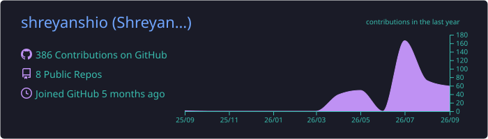
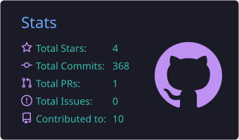
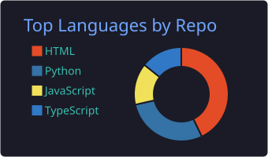
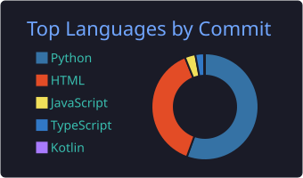
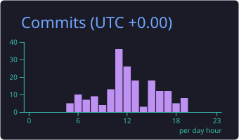

<b><i>Turning midnight ideas into fast, polished full-stack apps — explore my repos, drop a ⭐ on what you like, and let's build something great together.</i></b>

  
  
  

---

## 🧠 About

I build full-stack products end to end: database, backend, frontend and deployment. I like shipping fast, keeping things simple, and improving with real user feedback.

- 🎓 B.Tech AI/ML student at **Parul University**
- 🛠️ Building **TaskBoard**, **BRAINY Bot** and **Void Fetch**
- ☁️ Deploy on **Vercel**, **Cloudflare** and **Railway**

---

## 🛠️ Languages & Core

**Languages**
 

**Frontend & Design**
 

**Backend & Databases**
 

**Cloud & Deployment**
 

**Tools**
 

**APIs & AI**
 

---

## 🚀 Featured Projects

<table>
<tr>
<td width="33%" valign="top">

### 📋 [TaskBoard](https://github.com/shreyanshio/taskboard)
Student productivity platform with tasks, Pomodoro, analytics, calendar and Telegram login.

`FastAPI` `Supabase` `JavaScript`

</td>
<td width="33%" valign="top">

### 🧠 [BRAINY Bot](https://github.com/shreyanshio/BrainyAi)
AI study companion with multi-LLM fallback routing, quizzes, leaderboards and persistent memory.

`Python` `Telegram Bot API` `Multi-LLM`

</td>
<td width="33%" valign="top">

### ⬇️ [Void Fetch](https://github.com/shreyanshio/voidmedia_bot)
Social media downloader with multi-source fallback and song identification.

`Python` `yt-dlp` `Supabase`

</td>
</tr>
</table>

---

## 📊 GitHub Stats

---

## 🔥 Daily Commits

<picture>
  <source media="(prefers-color-scheme: dark)" srcset="https://raw.githubusercontent.com/shreyanshio/shreyanshio/output/github-snake-dark.svg" />
  <source media="(prefers-color-scheme: light)" srcset="https://raw.githubusercontent.com/shreyanshio/shreyanshio/output/github-snake.svg" />
  
</picture>

---

<i>Discipline &gt; Motivation</i>

